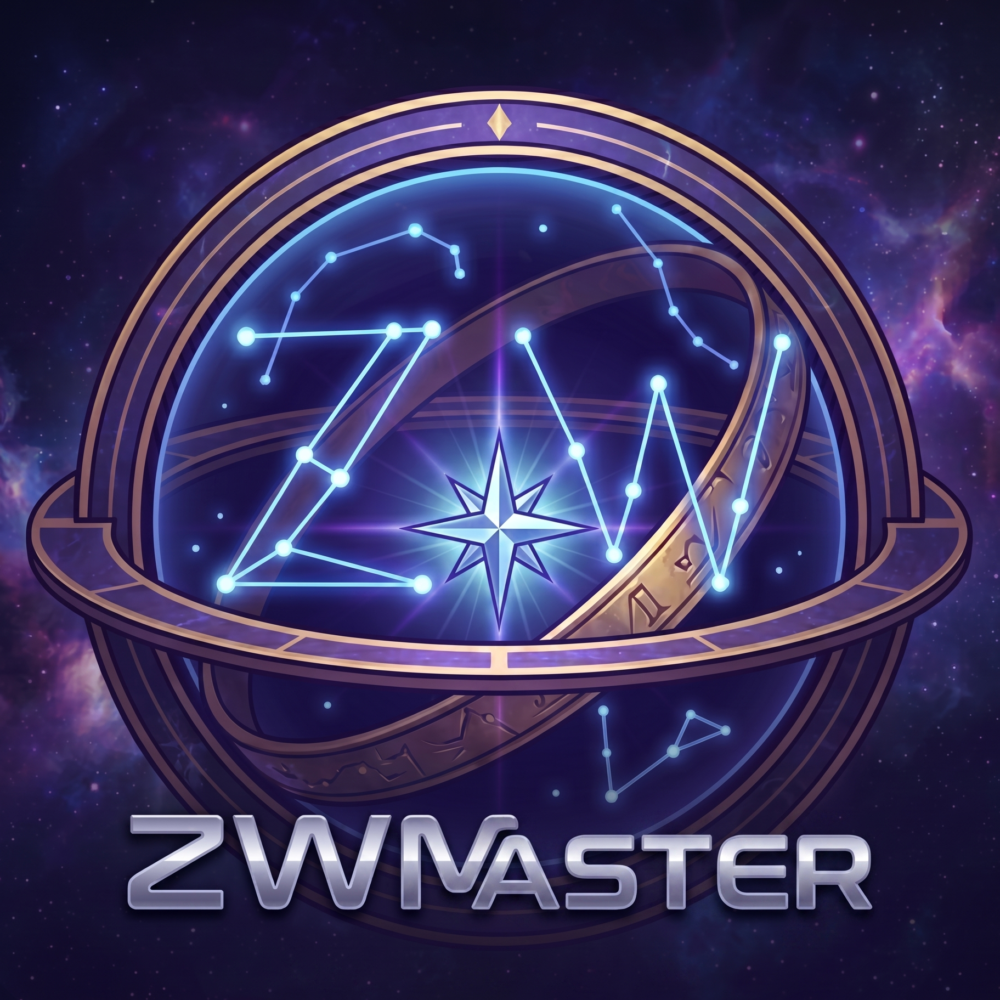
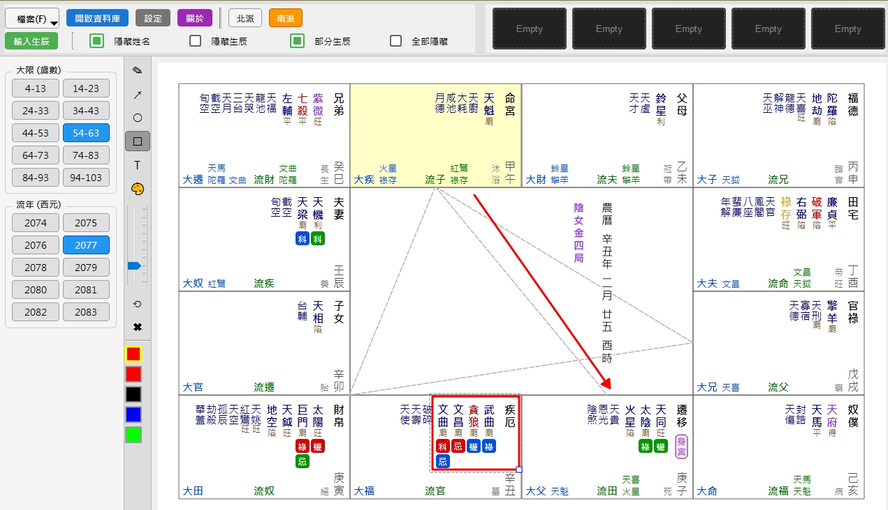
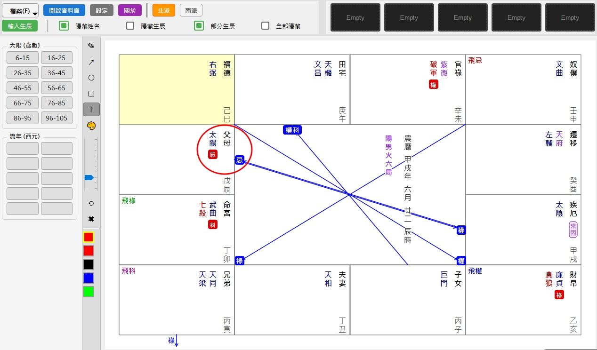
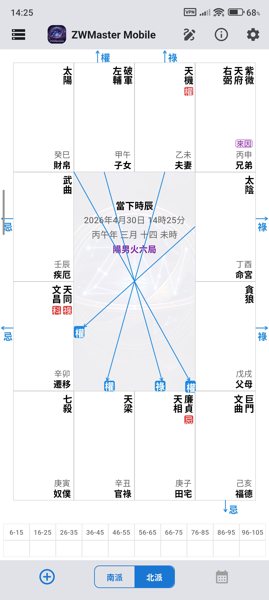
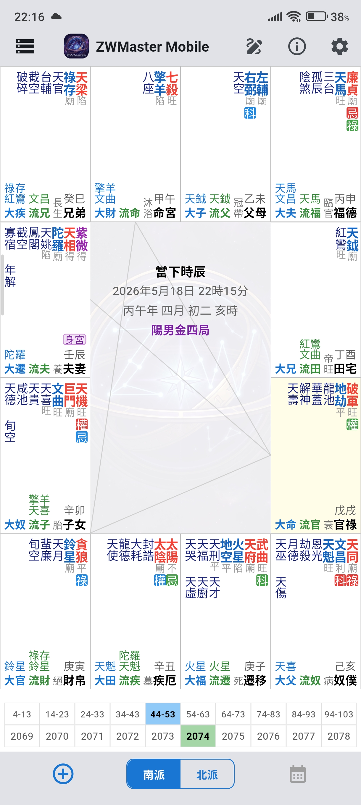
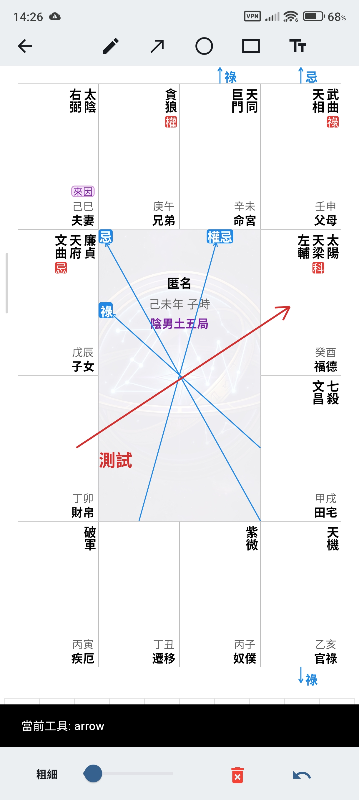

  

<h1 align="center">ZWMaster - 紫微斗數排盤專家</h1>

  
  

---

## 🌟 軟體簡介

ZWMaster 是一款專為紫微斗數愛好者、研究者及命理師設計的專業排盤軟體。我們致力於提供精確、彈性且跨平台的排盤體驗。無論是深度研究還是日常論命，ZWMaster 都能成為您的得力助手。

> **跨平台支援**：資料庫通用，可直接匯出匯入，無縫切換。

---

## 💻 桌面版 (Windows) - `ZWMaster.EXE`

提供最強大的繪圖與資料管理功能。

- **⚡ 獨家暫存功能**
  - 開啟新盤時，原資料自動推入「暫存區 1」，舊資料依序後推。
  - 操作直覺：左鍵交換資料、右鍵刪除、中鍵鎖定。
- **📂 資料庫快速鍵**
  - `m` 移動群組、`e` 編輯、`d` 刪除。
- **🧩 智慧型星曜堆疊**
  - 限流星曜依數量自動堆疊，可在設定中自訂換行顆數。
- **記憶功能**
  - 自動記憶視窗大小、位置及繪圖區拉桿設定。
- **🎨 進階繪圖**
  - 支援物件重複選取調整。
  - 支援 `Ctrl+Z` 上一步、`Ctrl+X` 剪下。
  - 可透過拉桿調整字體大小及線條粗細。

---

## 📱 行動版 (Android) - `app-release.APK`

隨身攜帶，隨時排盤，支援高度手動微調。

- **👤 匿名排盤**
  - 點選「手動排盤」（左下角 `+`），直接再次按下排盤即可。
- **👁️ 隱私保護**
  - 右下角按鈕可一鍵隱藏部分生辰資料。
- **🔄 螢幕旋轉自動重抓**
  - 若三方四正或自化線大幅偏移，只需旋轉螢幕方向即可自動對齊。
- **🛠️ 深度手動微調 (適配多種解析度)**
  - **X/Y 軸偏移**：微調三方四正與自化線頂點。
  - **字體調整**：自訂全域字體大小。
  - **星曜換行偏移**：自動偵測宮位寬度換行，此設定可 +/- 偵測值（`+` 延遲換行，`-` 提早換行）。
  - **星曜間距調整**：調大字體後若覺擁擠，可調大此值。

---

## 🌐 網頁版

另提供網頁版本，適合臨時點閱。
*(註：速度受限傳輸速率，載入及切換時有延遲感)*

👉 [立即存取 ZWMaster 網頁版](https://bit.ly/ZWMweb)

---

## 📸 軟體預覽 (Screenshots)

### 🖥️ Windows 版本

   
  

### 📱 Android 版本

  
  
  

---

## 📥 下載與更新

請至 [Releases](../../releases) 頁面下載最新版本的安裝檔。

> Bug 修正後會直接放上新版本，請由版本號判斷是否需要更新。

---

## 📄 授權與使用條款 (License)

本專案原始碼開放，但採用自訂授權條款。使用、修改或散佈本軟體即代表您同意以下條款：

1. **個人使用**：免費提供予個人學習與研究使用。
2. **可修改性**：允許依個人需求修改原始碼並重新編譯，**但必須在顯著位置清楚標示原始來源與作者**。
3. **禁止商用**：未經作者授權，嚴禁將本軟體用於商業營利行為。
4. **禁止冒名**：禁止以個人獨立創作之名義發布修改後的版本。

⚠️ 完整授權細節請參閱專案根目錄下的 [LICENSE](LICENSE) 檔案。

---

## 📩 聯絡作者

若有商業合作、特殊授權需求或 Bug 回報，請聯繫：
🔗 https://bit.ly/AuthZWM
